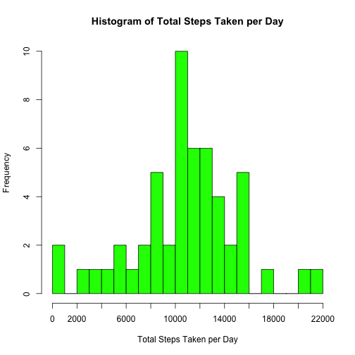
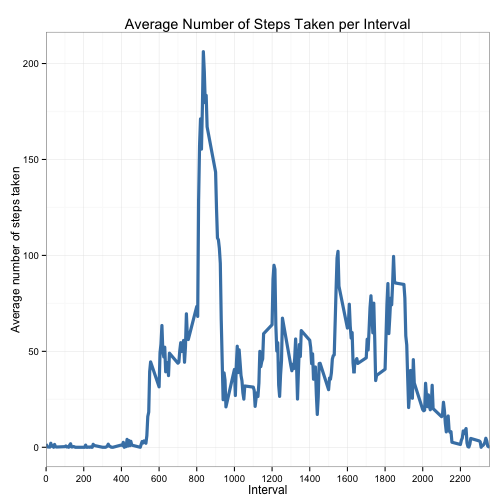
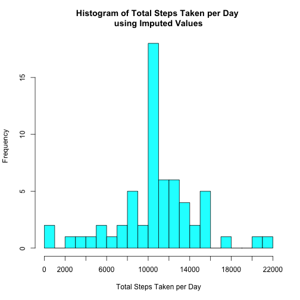
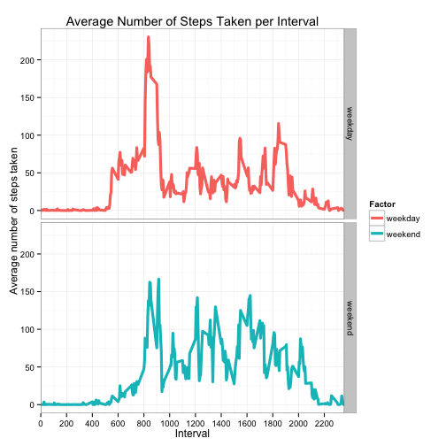

In this assignment, we are going to explore data collected from a personal activity monitoring device for a two month period. But before we begin, we need to load the data from a CSV file.

## Loading and preprocessing the data

We assume that a zip file named `"activity.zip"` is located in this directory. However, if it is not, we will download it from the link provided by our course instructors. Note that we are running RStudio Version 0.99.467 on OSX Version 10.10.4.  


```r
# if the zip file cannot be found in this directory, go get it
if (!file.exists("activity.zip")) {
    fileUrl <- "https://d396qusza40orc.cloudfront.net/repdata%2Fdata%2Factivity.zip"
    download.file(fileUrl, destfile = "activity.zip", method = "curl")
}
# unzip - we will now have a file called "activity.csv"
unzip("activity.zip")
# read in the data
activityData <- read.csv("activity.csv", stringsAsFactors = FALSE)
# convert the data variable to the Date class
activityData$date <- as.Date(activityData$date)
# summary of data
str(activityData)
```

```
## 'data.frame':	17568 obs. of  3 variables:
##  $ steps   : int  NA NA NA NA NA NA NA NA NA NA ...
##  $ date    : Date, format: "2012-10-01" "2012-10-01" ...
##  $ interval: int  0 5 10 15 20 25 30 35 40 45 ...
```
  
  From the output above, we see that `activityData` is a data.frame of 17568 observations. The 3 variables are `'steps'`, `'date'`, and `'interval'`, which are of the classes `int`, `Date`, and `int`, respectively. Now let's play!  

## What is mean total number of steps taken per day?

First, we are interested in seeing the total number of steps taken per day.


```r
# sum the number of steps for each day
stepsByDay <- aggregate(activityData$steps ~ activityData$date, FUN=sum, na.rm=TRUE)
# rename the columns
colnames(stepsByDay) <- c("day", "totalSteps")
# create a histogram and add the x-axis ticks and labels
hist(stepsByDay$totalSteps, col = "green", breaks = 20, main = "Histogram of Total Steps Taken per Day", 
     xaxt='n', xlim = c(0,22000), xlab = "Total Steps Taken per Day")
axis(side=1, at=seq(0,22000,2000), labels=seq(0,22000,2000))
```

 

The code above created a data frame called `stepsByDay` that has columns `day` and `totalSteps`. We can use this data structure to find the mean and median number of steps taken each day:


```r
mean(stepsByDay$totalSteps)
```

```
## [1] 10766.18868
```

```r
median(stepsByDay$totalSteps)
```

```
## [1] 10765
```
We could have also obtained these numbers using the `summary` function. Let's see how the results compare:


```r
# print an appropriate number of digits
options(digits=10)
summary(stepsByDay$totalSteps)
```

```
##     Min.  1st Qu.   Median     Mean  3rd Qu.     Max. 
##    41.00  8841.00 10765.00 10766.19 13294.00 21194.00
```

We have confirmed that the mean total number of steps taken per day is 10766.19 and the median total number of steps taken per day is 10765.  

## What is the average daily activity pattern?

Now we would like to explore possible daily activity patterns and to do that we will consider the `interval` variable. We are told that this variable is coded as the 5 minute interval in which the measurement was taken. Let's see what the values look like:


```r
range(activityData$interval)
```

```
## [1]    0 2355
```

```r
unique(activityData$interval)
```

```
##   [1]    0    5   10   15   20   25   30   35   40   45   50   55  100  105
##  [15]  110  115  120  125  130  135  140  145  150  155  200  205  210  215
##  [29]  220  225  230  235  240  245  250  255  300  305  310  315  320  325
##  [43]  330  335  340  345  350  355  400  405  410  415  420  425  430  435
##  [57]  440  445  450  455  500  505  510  515  520  525  530  535  540  545
##  [71]  550  555  600  605  610  615  620  625  630  635  640  645  650  655
##  [85]  700  705  710  715  720  725  730  735  740  745  750  755  800  805
##  [99]  810  815  820  825  830  835  840  845  850  855  900  905  910  915
## [113]  920  925  930  935  940  945  950  955 1000 1005 1010 1015 1020 1025
## [127] 1030 1035 1040 1045 1050 1055 1100 1105 1110 1115 1120 1125 1130 1135
## [141] 1140 1145 1150 1155 1200 1205 1210 1215 1220 1225 1230 1235 1240 1245
## [155] 1250 1255 1300 1305 1310 1315 1320 1325 1330 1335 1340 1345 1350 1355
## [169] 1400 1405 1410 1415 1420 1425 1430 1435 1440 1445 1450 1455 1500 1505
## [183] 1510 1515 1520 1525 1530 1535 1540 1545 1550 1555 1600 1605 1610 1615
## [197] 1620 1625 1630 1635 1640 1645 1650 1655 1700 1705 1710 1715 1720 1725
## [211] 1730 1735 1740 1745 1750 1755 1800 1805 1810 1815 1820 1825 1830 1835
## [225] 1840 1845 1850 1855 1900 1905 1910 1915 1920 1925 1930 1935 1940 1945
## [239] 1950 1955 2000 2005 2010 2015 2020 2025 2030 2035 2040 2045 2050 2055
## [253] 2100 2105 2110 2115 2120 2125 2130 2135 2140 2145 2150 2155 2200 2205
## [267] 2210 2215 2220 2225 2230 2235 2240 2245 2250 2255 2300 2305 2310 2315
## [281] 2320 2325 2330 2335 2340 2345 2350 2355
```

We observe that the values range from 0 to 2355. The values start a 0, then increment by 5 until 55, then the next value is 100. This same pattern repeats within each hundreds interval. For example, after 100, the values increment by 5 until 155, and then jump to 200. We will assume this is coded as the interval start time, described by the 24 hour clock, which can be padding with leading 0's to form a four-digit number that represents the hour and minute. For example, 105 would be padded with one leading 0 to form 0105. The first two numbers represent the hour, so 01 (or 1 am), and the last two numbers represent the minute 05. So the interval value of 105 is the observation corresponding to the 5 minute interval starting at 1:05 am.  

We would like to see if there are any daily trends in these intervals, so we create a time series plot of each 5 minute interval and the average number of steps taken during that interval across all the days.


```r
# average the number of steps for each interval
stepsByInterval <- aggregate(activityData$steps ~ activityData$interval, FUN=mean, na.rm=TRUE)
# rename the columns
colnames(stepsByInterval) <- c("interval", "averageSteps")
# create a line plot of the average steps taken per interval
library(ggplot2)
ggplot(stepsByInterval, aes(interval, averageSteps)) + geom_line(col="steelblue",lwd=1.5) + theme_bw() + 
    coord_cartesian(xlim = c(0,2355)) + scale_x_continuous(breaks=seq(0, 2400, 200)) + 
    labs(x="Interval",y="Average number of steps taken", title="Average Number of Steps Taken per Interval")
```

 

From the plot above we can see a distinct spike in number of steps taken between approximately 8 and 9 am. We can find the observation with the highest average number of step taken using the `max()` function:


```r
subset(stepsByInterval, stepsByInterval$averageSteps==max(stepsByInterval$averageSteps))
```

```
##     interval averageSteps
## 104      835  206.1698113
```
Therefore, on avergae, interval 835 corresponding to the 5-minute interval starting at 8:35 am contains the maximum number of steps.

## Imputing missing values

We noticed at the onset of our exploration from the output of the `str()` function that there we several NA values reported for the `steps` variable. We can count the number of NA's in `steps` using:


```r
sum(is.na(activityData$steps))
```

```
## [1] 2304
```

2304 NA's are reported in the `steps` column. If we do the same for the other two variables, we can confirm that there are no NAs in either of the other two columns.


```r
sum(is.na(activityData$interval))
```

```
## [1] 0
```

```r
sum(is.na(activityData$date))
```

```
## [1] 0
```

We coud have also made this conclusion using `summary`, as shown below:

```r
summary(activityData)
```

```
##      steps               date               interval      
##  Min.   :  0.0000   Min.   :2012-10-01   Min.   :   0.00  
##  1st Qu.:  0.0000   1st Qu.:2012-10-16   1st Qu.: 588.75  
##  Median :  0.0000   Median :2012-10-31   Median :1177.50  
##  Mean   : 37.3826   Mean   :2012-10-31   Mean   :1177.50  
##  3rd Qu.: 12.0000   3rd Qu.:2012-11-15   3rd Qu.:1766.25  
##  Max.   :806.0000   Max.   :2012-11-30   Max.   :2355.00  
##  NA's   :2304
```

Since we see on the bottom line of the output that there are 2304 NA's reported in the data set and we have determined that there are 2304 NA's in the `steps` column, we know the other columns must be complete.

We would like to replace the NA's with some value to see how this will affect the total number of steps taken each day. Since we have seen that the number of steps taken seems to vary according to the time of day, we will fill in the missing values using the values computed above - the average number of steps for each 5-minute interval. 


```r
# create a copy of activityData 
imputedActivityData <- activityData
# add the average interval steps as a column to the data frame
imputedActivityData <- cbind(imputedActivityData,stepsByInterval$averageSteps)
# find the rows with NA's
naIndexVector <- which(is.na(imputedActivityData))
# replace the NA with average steps for that 5-minute interval
imputedActivityData[naIndexVector,]$steps <- imputedActivityData[naIndexVector,4]
# we should now find that there are 0 NAs in the steps column
sum(is.na(imputedActivityData$steps))
```

```
## [1] 0
```

Success!

Let's take another look at a histogram of the total steps taken per day now that we have replaced the missing values:


```r
# sum the number of steps for each day
stepsByDay <- aggregate(imputedActivityData$steps ~ imputedActivityData$date, FUN=sum, na.rm=TRUE)
# rename the columns
colnames(stepsByDay) <- c("day", "totalSteps")
# create a histogram and add the x-axis ticks and labels
hist(stepsByDay$totalSteps, col = "cyan", breaks = 20, 
     main = "Histogram of Total Steps Taken per Day \nusing Imputed Values", xaxt='n', 
     xlim = c(0,22000), xlab = "Total Steps Taken per Day")
axis(side=1, at=seq(0,22000,2000), labels=seq(0,22000,2000))
```

 

Again, we can use the data frame we created in the code above called `stepsByDay` to find the mean and median number of steps taken each day:


```r
mean(stepsByDay$totalSteps)
```

```
## [1] 10766.18868
```

```r
median(stepsByDay$totalSteps)
```

```
## [1] 10766.18868
```
Compared to output from the `summary` function:


```r
# print an appropriate number of digits
options(digits=10)
summary(stepsByDay$totalSteps)
```

```
##     Min.  1st Qu.   Median     Mean  3rd Qu.     Max. 
##    41.00  9819.00 10766.19 10766.19 12811.00 21194.00
```
So we find that the mean and median are both now 10766.19 (rounded where applicable). Recall that this is the same mean value we computed before replacing the NA's. The median has incresed by a little more than one step from 10765 to 10766.19. This demonstrates that imputing the missing values has had little impact on the estimates of the total daily number of steps.  

## Are there differences in activity patterns between weekdays and weekends?

Our final analysis with this data set will be to compare the average steps taken on weekdays to weekends. First, we will add a factor variable to the imputed data, then we will create a plot similar to the Average Number of Steps Taken plot above. However, this time we will create separate plots for weekdays and weekends.

```r
# create the a vector of weekend days
weekendDays <- c("Saturday","Sunday")
# add a new column to the imputed data set based on
# whether the day is in the weekendDays vector
imputedActivityData$dayFactor <- ifelse(weekdays(imputedActivityData$date) %in% weekendDays,"weekend","weekday")
# convert to factor
imputedActivityData$dayFactor <- as.factor(imputedActivityData$dayFactor)
# average the number of steps for each interval by factor
stepsByInterval <- aggregate(imputedActivityData$steps,
                             by=list(imputedActivityData$interval,imputedActivityData$dayFactor), 
                             FUN=mean, na.rm=TRUE)
# rename the columns
colnames(stepsByInterval) <- c("interval", "Factor", "averageSteps")
# create a line plot of the average steps taken per interval for factors
ggplot(stepsByInterval, aes(interval, averageSteps, colour = Factor)) + geom_line(lwd=1.5) + 
    theme_bw() + coord_cartesian(xlim = c(0,2355)) + facet_grid(Factor ~ .) +
    scale_x_continuous(breaks=seq(0, 2400, 200)) +
    labs(x="Interval",y="Average number of steps taken", title="Average Number of Steps Taken per Interval")
```

 

From the plots above, we can see that the 8 - 9 am spike in steps is mostly due to weekdays and the average number of steps is more evenly distributed among the intervals on the weekend. It also seems that the test subject is an early bird who get up a little before 6 am - *shudder*!
